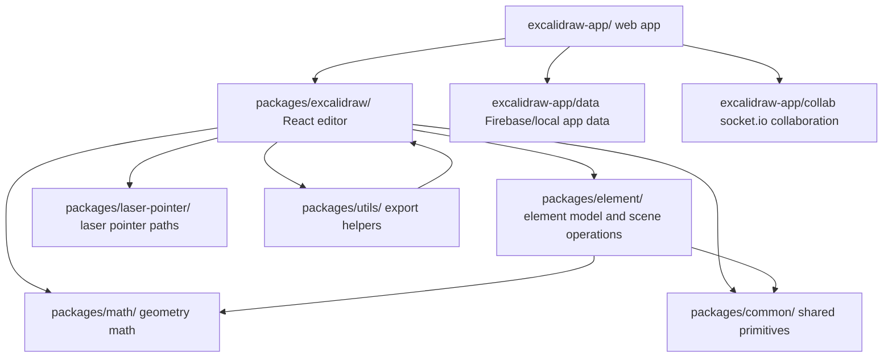

# Architecture

## System Shape

Excalidraw is a package-oriented monorepo. The app imports the editor package, while lower packages provide reusable model, geometry, utility, and rendering support.



## Package Responsibilities

| Path | Responsibility |
| --- | --- |
| `packages/excalidraw/` | Public React component, editor app state, actions, UI, rendering orchestration, import/export APIs, i18n, scene export. |
| `packages/element/` | Element types, scene storage, element mutation, binding, frames, selection, collision, geometry-related element operations, Store delta/history support. |
| `packages/common/` | Shared constants, colors, URL/key helpers, event bus, queues, random IDs, utilities. |
| `packages/math/` | Pure math primitives for points, vectors, lines, curves, ranges, polygons, rectangles, ellipses. |
| `packages/utils/` | Package-level export utilities and shape helpers used by integrators. |
| `packages/laser-pointer/` | Laser pointer state and path simplification. |
| `packages/fractional-indexing/` | Ordering string generation for stable element ordering. |
| `excalidraw-app/` | Production web app shell, Firebase, local persistence, collaboration, share dialog, Sentry, app-only UI. |
| `dev-docs/` | Docusaurus documentation site. |
| `examples/` | Integration examples for package consumers. |

## Runtime State Model

The editor centers on three related concepts:

- `Scene` in `packages/element/src/Scene.ts` stores all elements, non-deleted element views, frames, maps, selected-element caches, and a renderer cache nonce.
- `Store` in `packages/element/src/store.ts` captures observed element/appState changes as durable or ephemeral increments.
- `AppState` in `packages/excalidraw/types.ts` and defaults in `packages/excalidraw/appState.ts` hold editor UI/runtime state.

Use the existing update paths so that caches, undo/redo, collaboration, rendering, and tests stay coherent.

## Store Capture Semantics

`CaptureUpdateAction` controls history and store emission:

| Action | Use for |
| --- | --- |
| `IMMEDIATELY` | User-visible local updates that should become undoable now. |
| `EVENTUALLY` | Multi-step async updates that should become undoable with a later commit. |
| `NEVER` | Remote updates, initialization, or other updates that must not enter local undo history. |

Landmine: using the wrong action can make remote collaboration undoable locally, or can drop a user-visible edit from undo history.

## Ordering And Frames

Frame children must appear before their frame element:

```ts
[
  frameChildA,
  frameChildB,
  frame,
]
```

The editor can tolerate imperfect ordering in some cases, but rendering and clipping optimizations rely on correct order. See `dev-docs/docs/codebase/frames.mdx` and `packages/element/src/frame.ts`.

## App Services

`excalidraw-app/` owns browser and backend integrations:

- `excalidraw-app/collab/Collab.tsx` wires editor events to collaboration.
- `excalidraw-app/collab/Portal.tsx` owns socket room communication.
- `excalidraw-app/data/firebase.ts` reads/writes encrypted scenes and files.
- `excalidraw-app/data/LocalData.ts` and `localStorage.ts` manage local-first browser data.
- `excalidraw-app/data/FileManager.ts` handles image file upload/download status.

Do not move these dependencies into `packages/excalidraw/` unless the package API is intentionally changing.

## Build Boundaries

Root scripts delegate:

- App: `yarn --cwd ./excalidraw-app build`
- Packages: `scripts/buildBase.js`, `scripts/buildPackage.js`, `scripts/buildUtils.js`
- Docs: `yarn --cwd dev-docs build`

The package exports in `packages/*/package.json` map published `dist/` files, while TypeScript/Vitest path aliases point tests and local development to source files.
