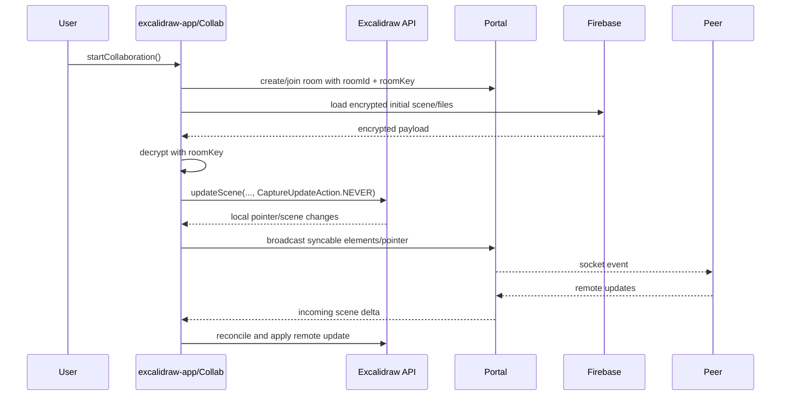

# Flow: Collaboration

## Purpose

The app supports realtime collaboration through an encrypted room link, socket.io room events, Firebase-backed persistence, and file upload/download handling.

This flow is app-owned. Most code lives under `excalidraw-app/` and calls into the editor package through the public imperative API.

For the full external service map, including `excalidraw-room`, Firestore, and Firebase Storage responsibilities, load `agent_docs/backend_services.md`.

## Main Files

| File | Role |
| --- | --- |
| `excalidraw-app/collab/Collab.tsx` | React owner for collaboration state, editor event subscriptions, sync orchestration, file manager wiring. |
| `excalidraw-app/collab/Portal.tsx` | Socket room portal and broadcast/listen behavior. |
| `excalidraw-app/data/index.ts` | Collaboration link generation, syncable element helpers. |
| `excalidraw-app/data/firebase.ts` | Encrypted Firebase scene/file persistence. |
| `excalidraw-app/data/FileManager.ts` | Upload/download lifecycle for image files. |
| `excalidraw-app/data/tabSync.ts` | Browser-tab state/version reset and sync. |
| `packages/excalidraw/data/encryption.ts` | AES-GCM encryption/decryption helpers. |
| `packages/excalidraw/data/reconcile.ts` | Remote/local element reconciliation. |
| `excalidraw-app/app_constants.ts` | WS event names, thresholds, upload limits, sync intervals. |

## High-Level Flow



## Security Model

- Room links carry enough information to derive or include room access data.
- Scene and file data are encrypted with room keys before Firebase storage.
- `packages/excalidraw/data/encryption.ts` uses Web Crypto AES-GCM.
- Do not log room keys, decrypted scene payloads, or file contents.
- Do not make remote updates undoable in the local user's history.

## Syncable Elements

Collaboration should send only syncable elements. Use helpers from `excalidraw-app/data/index.ts` rather than inventing filtering logic.

Landmines:

- Deleted elements can still be relevant for reconciliation.
- Image files need separate upload/download handling through `FileManager`.
- Remote element versions and local element versions are reconciled, not simply overwritten.

## Store/History Rules

Remote scene application should not become a local undo step. Prefer `CaptureUpdateAction.NEVER` for remote initialization and incoming collaboration updates unless surrounding code proves otherwise.

Local visible user edits that should be undoable normally use `CaptureUpdateAction.IMMEDIATELY`.

## Offline And Idle Behavior

`Collab.tsx` listens to:

- browser `online`/`offline`
- `beforeunload`/`unload`
- user activity/idle thresholds
- scroll and pointer updates

Avoid introducing unthrottled broadcasts. Existing code uses throttling helpers such as `throttleRAF` and `lodash.throttle`.

## Testing

Relevant tests:

```bash
yarn test:app excalidraw-app/tests/collab.test.tsx --watch=false
```

Also consider element reconciliation tests or app data tests when changing how elements/files are merged.

## Local Development Note

`yarn start` starts the web app. Full local collaboration requires a separate collab server (`excalidraw-room`) and appropriate environment configuration.
