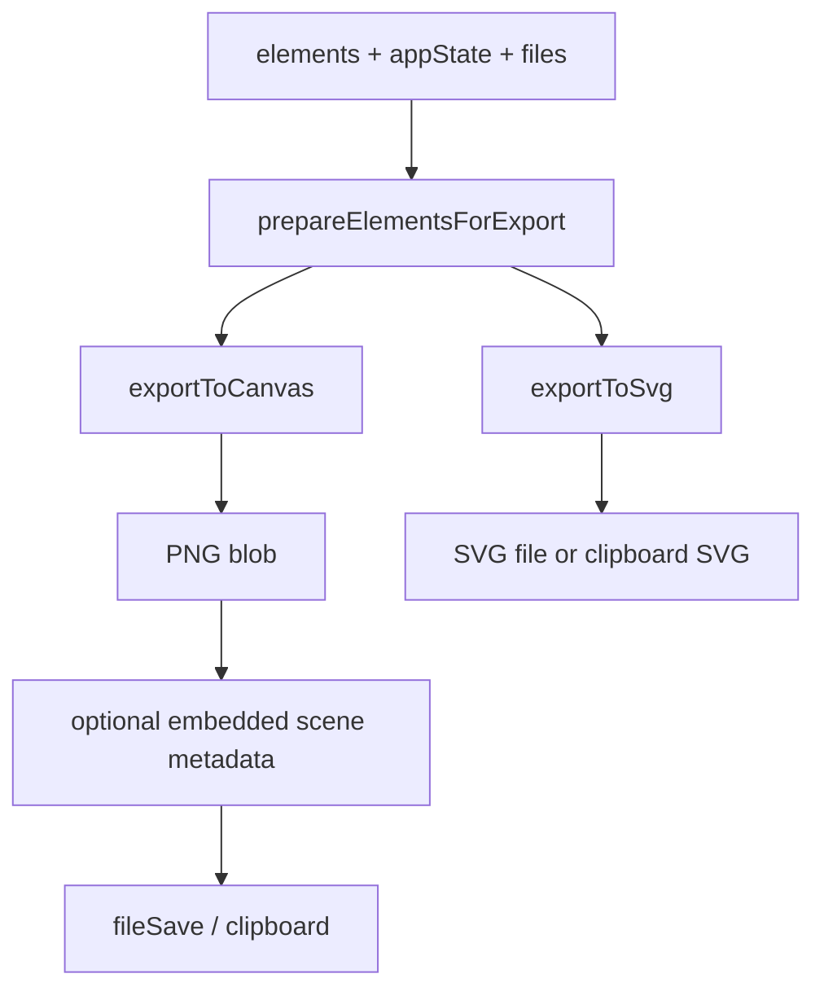
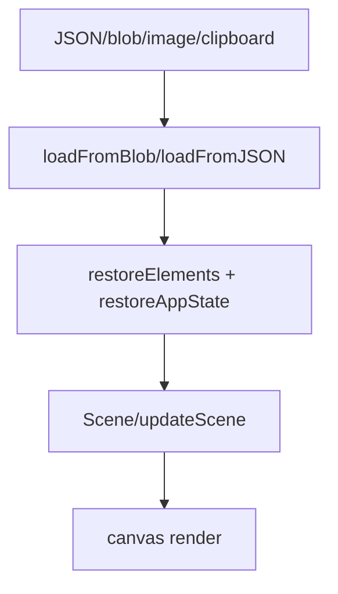

# Flow: Import And Export

## Purpose

Excalidraw scenes can be saved as `.excalidraw` JSON, embedded into exported PNG/SVG, copied through the clipboard, restored from blobs, and synchronized with binary image files.

The canonical human-facing schema is documented in `dev-docs/docs/codebase/json-schema.mdx`.

## Main Files

| File | Role |
| --- | --- |
| `packages/excalidraw/data/json.ts` | Save/load `.excalidraw` JSON and serialization. |
| `packages/excalidraw/data/blob.ts` | Blob loading and MIME handling. |
| `packages/excalidraw/data/image.ts` | PNG metadata encode/decode for embedded scenes. |
| `packages/excalidraw/data/index.ts` | Export orchestration and public data exports. |
| `packages/excalidraw/data/restore.ts` | Restore, normalize, and migrate imported scene data. |
| `packages/excalidraw/data/filesystem.ts` | Browser file open/save integration. |
| `packages/excalidraw/scene/export.ts` | Canvas/SVG export rendering. |
| `packages/utils/src/export.ts` | Export helpers for package consumers. |
| `packages/excalidraw/clipboard.ts` | Clipboard read/write helpers. |
| `packages/excalidraw/data/types.ts` | Imported/exported data types. |

## `.excalidraw` Shape

The stored JSON object contains:

```json
{
  "type": "excalidraw",
  "version": 2,
  "source": "https://excalidraw.com",
  "elements": [],
  "appState": {},
  "files": {}
}
```

`files` is keyed by file id and stores image data used by image elements.

## Export Flow



`prepareElementsForExport()` in `packages/excalidraw/data/index.ts` handles selection-only export and frame export behavior.

## Import/Restore Flow



Use restoration helpers instead of trusting raw imported data. They normalize element shape, app state, versions, deleted flags, and legacy data.

## Images And Files

- Image elements reference entries in the `files` map by `fileId`.
- File data is necessary for export and collaboration upload/download.
- Large image handling may use browser APIs and async reduction helpers.
- Collaboration file persistence is app-owned in `excalidraw-app/data/FileManager.ts` and `firebase.ts`.

## Landmines

- Empty canvas export throws `alerts.cannotExportEmptyCanvas`.
- Clipboard image/SVG behavior varies by browser; Firefox has special handling in `exportCanvas`.
- Embedded scene metadata changes output file extensions (`.excalidraw.png`, `.excalidraw.svg`).
- Frame export can include elements overlapping the selected frame, not merely the frame element itself.
- Always preserve the difference between `elements` including deleted items and non-deleted export elements.

## Tests

Useful focused tests:

```bash
yarn test:app packages/excalidraw/data/library.test.ts --watch=false
yarn test:app packages/utils/tests/export.test.ts --watch=false
yarn test:app packages/excalidraw/clipboard.test.ts --watch=false
```

When changing schema restoration or element normalization, also run affected element tests and `yarn test:typecheck`.
